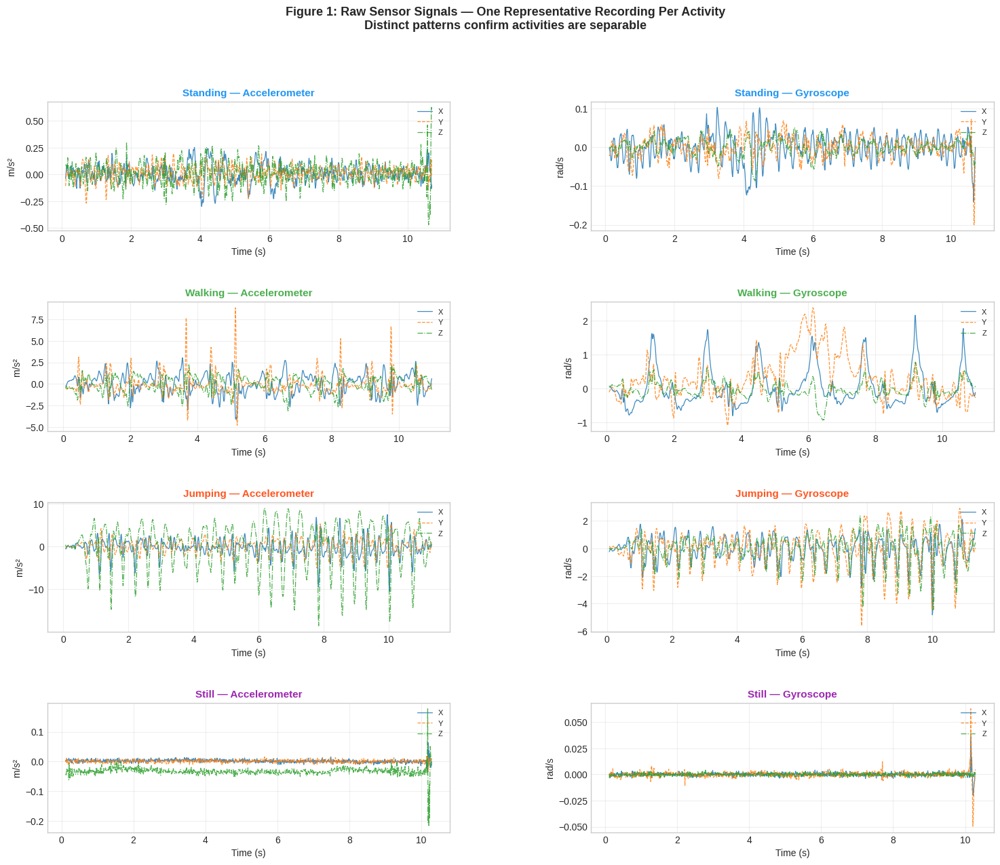
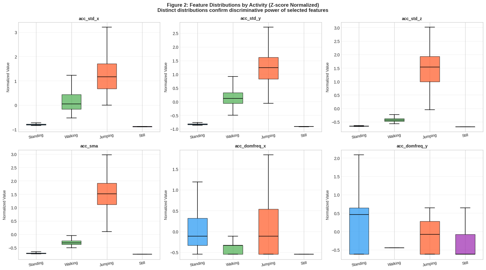
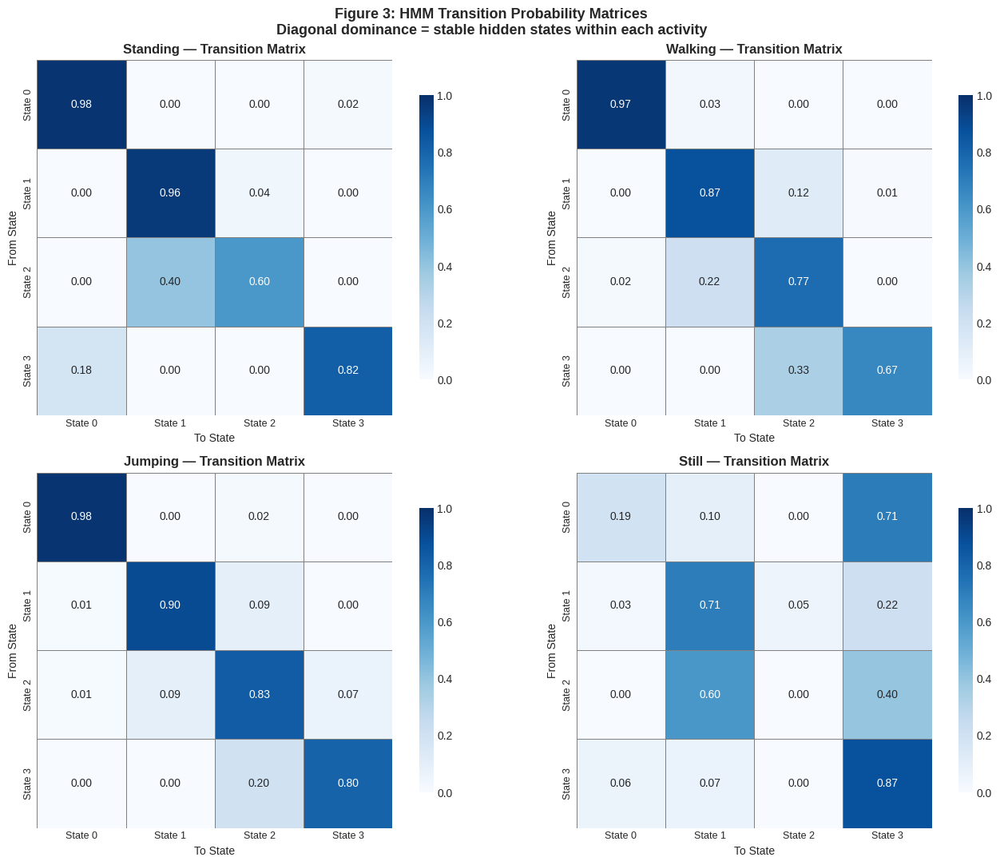
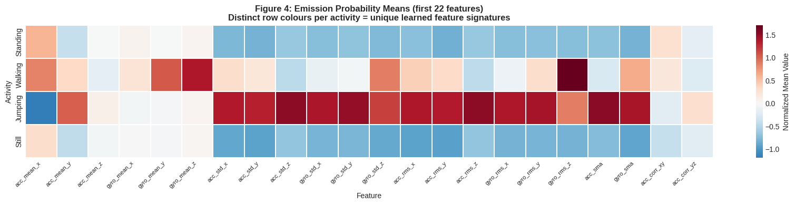
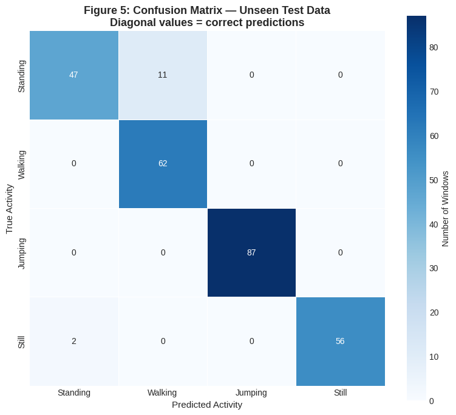
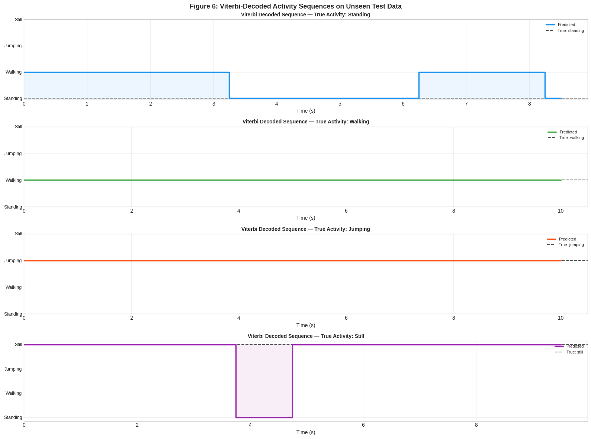
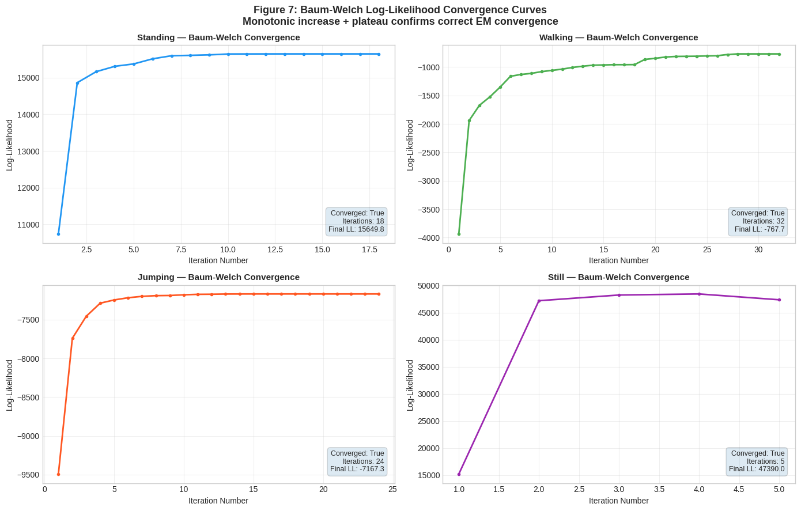

# 🏃 Human Activity Recognition Using Hidden Markov Models

> **Course:** Machine Learning — Formative 2
> **Group Members:** Jean de Dieu Muhirwa Harerimana · Fidele Ndihokubwayo
> **Date:** March 2026
> **GitHub Repository:** [Fidele012/Formative-2---Hidden-Markov-Models](https://github.com/Fidele012/Formative-2---Hidden-Markov-Models)

---

## 📋 Table of Contents

1. [Project Overview](#-project-overview)
2. [Background and Motivation](#-background-and-motivation)
3. [Repository Structure](#-repository-structure)
4. [Dataset](#-dataset)
   - [Activities Recorded](#activities-recorded)
   - [Recording Setup](#recording-setup)
   - [Data Collection Protocol](#data-collection-protocol)
   - [Sampling Rate Harmonization](#sampling-rate-harmonization)
   - [Dataset Summary](#dataset-summary)
5. [Prerequisites and Installation](#-prerequisites-and-installation)
6. [Getting Started](#-getting-started)
7. [Notebook Walkthrough](#-notebook-walkthrough)
   - [Step 1 — Setup and Imports](#step-1--setup-and-imports)
   - [Step 2 — Configuration and Constants](#step-2--configuration-and-constants)
   - [Step 3 — Data Loading and Duration Audit](#step-3--data-loading-and-duration-audit)
   - [Step 4 — Raw Signal Visualisation](#step-4--raw-signal-visualisation)
   - [Step 5 — Feature Extraction](#step-5--feature-extraction)
   - [Step 6 — Sliding Window and Feature Matrix](#step-6--sliding-window-and-feature-matrix)
   - [Step 7 — Z-score Normalization](#step-7--z-score-normalization)
   - [Step 8 — Feature Distribution Visualisation](#step-8--feature-distribution-visualisation)
   - [Step 9 — HMM Training via Baum-Welch](#step-9--hmm-training-via-baum-welch)
   - [Step 10 — Transition and Emission Visualisation](#step-10--transition-and-emission-visualisation)
   - [Step 11 — Viterbi Decoding and Classification](#step-11--viterbi-decoding-and-classification)
   - [Step 12 — Unseen Test Data Loading](#step-12--unseen-test-data-loading)
   - [Step 13 — Confusion Matrix and Per-class Metrics](#step-13--confusion-matrix-and-per-class-metrics)
   - [Step 14 — Decoded Activity Sequence Plots](#step-14--decoded-activity-sequence-plots)
   - [Step 15 — Baum-Welch Convergence Plots](#step-15--baum-welch-convergence-plots)
   - [Step 16 — Analysis and Reflection](#step-16--analysis-and-reflection)
   - [Step 17 — Final Summary](#step-17--final-summary)
8. [Feature Engineering](#-feature-engineering)
   - [Time-Domain Features](#time-domain-features)
   - [Frequency-Domain Features](#frequency-domain-features)
9. [HMM Architecture](#-hmm-architecture)
   - [Model Design](#model-design)
   - [Baum-Welch Training](#baum-welch-training)
   - [Viterbi Decoding](#viterbi-decoding)
10. [Results](#-results)
    - [Convergence Summary](#convergence-summary)
    - [Evaluation Metrics](#evaluation-metrics)
    - [Figures Generated](#figures-generated)
11. [Discussion](#-discussion)
12. [Task Allocation](#-task-allocation)
13. [References](#-references)

---

## 🎯 Project Overview

This project implements a complete **Human Activity Recognition (HAR)** pipeline using **Hidden Markov Models (HMMs)** to classify four distinct physical activities from raw smartphone inertial sensor data.

The pipeline covers every stage from raw data collection, through preprocessing, feature extraction, model training, and evaluation on completely unseen test recordings. One independent Gaussian HMM is trained per activity class using the **Baum-Welch algorithm** (Expectation-Maximization for HMMs), and classification is performed at inference time using **Viterbi decoding** — selecting the activity whose HMM assigns the highest log-probability to the observed feature sequence.

**Key results at a glance:**

| Metric | Value |
|---|---|
| Overall test accuracy | **95.1%** |
| Training windows | 1,127 |
| Test windows | 265 |
| Features per window | 30 |
| HMM states per model | 4 |
| All models converged | ✅ Yes |

---

## 🧠 Background and Motivation

Human Activity Recognition is a foundational applied machine learning problem with broad real-world relevance:

- **Healthcare:** Rehabilitation monitoring, fall detection in elderly care, energy expenditure estimation in fitness wearables
- **Smart home:** Context-aware automation — adjusting lighting when a user is stationary, triggering alerts for unexpected movement
- **Sports science:** Gait analysis, training load monitoring, performance analytics

The core challenge in HAR is that the **true underlying activity is not directly observable**. We only receive noisy, high-dimensional sensor signals from accelerometers and gyroscopes. Hidden Markov Models are well-suited to this problem because they:

1. Explicitly model the **sequential, temporal structure** of human movement
2. **Account for observation uncertainty** through probabilistic emission distributions
3. Can capture **intra-activity sub-phases** (e.g., heel-strike → mid-stance → toe-off within a walking cycle) through multiple hidden states
4. Provide **interpretable parameters** — transition matrices that reflect real biomechanical behaviour

---

## 📁 Repository Structure

```
Formative-2---Hidden-Markov-Models/
│
├── dataset/
│   ├── train/
│   │   ├── standing/
│   │   │   ├── standing_001.csv
│   │   │   ├── standing_002.csv
│   │   │   └── ... (14 files)
│   │   ├── walking/
│   │   │   ├── walking_001.csv
│   │   │   └── ... (14 files)
│   │   ├── jumping/
│   │   │   ├── jumping_001.csv
│   │   │   └── ... (15 files)
│   │   └── still/
│   │       ├── still_001.csv
│   │       └── ... (14 files)
│   │
│   └── test/
│       ├── standing/   → standing_011.csv ... standing_013.csv  (3 files)
│       ├── walking/    → walking_011.csv  ... walking_013.csv   (3 files)
│       ├── jumping/    → jumping_011.csv  ... jumping_014.csv   (4 files)
│       └── still/      → still_011.csv   ... still_013.csv     (3 files)
│
├── figures/
│   ├── fig1_raw_signals.png
│   ├── fig2_feature_distributions.png
│   ├── fig3_transition_matrices.png
│   ├── fig4_emission_heatmap.png
│   ├── fig5_confusion_matrix.png
│   ├── fig6_decoded_sequences.png
│   └── fig7_convergence.png
│
├── Formative_2_Hidden_Markov_Models.ipynb   ← Main notebook
├── extract_data.py                          ← Preprocessing script
└── README.md
```

Each CSV file contains **8 columns** produced by the preprocessing pipeline:

| Column | Description | Unit |
|---|---|---|
| `time` | UTC timestamp | nanoseconds |
| `seconds_elapsed` | Time since recording start | seconds |
| `accel_x` | Accelerometer — X axis | m/s² |
| `accel_y` | Accelerometer — Y axis | m/s² |
| `accel_z` | Accelerometer — Z axis | m/s² |
| `gyro_x` | Gyroscope — X axis | rad/s |
| `gyro_y` | Gyroscope — Y axis | rad/s |
| `gyro_z` | Gyroscope — Z axis | rad/s |

---

## 📊 Dataset

### Activities Recorded

Four distinct human activities were recorded, chosen to represent a spectrum from zero motion to high-intensity movement:

| Activity | Description | Expected Signal Characteristics |
|---|---|---|
| **Still** | Phone placed on a flat, immobile surface | Near-zero values on all axes; minimal variability |
| **Standing** | Phone held at waist level, person stationary | Gravity-dominated z-axis (~9.81 m/s²); slight postural sway |
| **Walking** | Normal walking pace, phone held at waist | Rhythmic 1–2 Hz oscillations; coordinated inter-axis movement |
| **Jumping** | Continuous jumping in place | Large-amplitude 2–4 Hz periodic spikes; highest energy of all activities |

### Recording Setup

Data was collected using the **Sensor Logger** app, which simultaneously records accelerometer and gyroscope data from the phone's built-in IMU sensors.

| Member | Activities Recorded | Sampling Rate | App Version |
|---|---|---|---|
| Jean de Dieu Muhirwa Harerimana | Jumping, Walking | 100 Hz (10 ms/sample) | Sensor Logger v1.54 |
| Fidele Ndihokubwayo | Standing, Still | 99.4 Hz | Sensor Logger v1.54 |

### Data Collection Protocol

- **Duration per file:** 5–14 seconds per recording session
- **Minimum total per activity:** ≥ 90 seconds (rubric requirement — verified by duration audit in notebook)
- **File format:** The Sensor Logger app outputs separate `Accelerometer.csv` and `Gyroscope.csv` per session
- **Preprocessing:** The `extract_data.py` script merges these into a single unified CSV per recording by aligning on the shared nanosecond timestamp (inner join), then renames the output using standardised labels (e.g., `jumping_001.csv`, `standing_002.csv`)
- **Train/test split:** Training files are numbered `_001` through `_014/015`; test files are numbered `_011` onward, collected in entirely separate sessions not used during model fitting

### Sampling Rate Harmonization

The two phones recorded at slightly different rates (100 Hz vs. 99.4 Hz). To ensure a consistent time grid across all downstream operations (windowing, FFT frequency resolution, duration calculations), all recordings are resampled to a uniform **100 Hz** using `scipy.signal.resample`. Given that human motion signals occupy the 0–5 Hz band, the 0.6 Hz difference introduces negligible interpolation artefacts.

### Dataset Summary

| Activity | Train Files | Test Files | Train Windows | Total Train Duration |
|---|---|---|---|---|
| Standing | 14 | 3 | 259 | 140.0 s ✅ |
| Walking | 14 | 3 | 283 | 152.5 s ✅ |
| Jumping | 15 | 4 | 317 | 169.1 s ✅ |
| Still | 14 | 3 | 268 | 144.9 s ✅ |
| **Total** | **57** | **13** | **1,127** | **≥ 90 s each** |

> ✅ All activities confirmed to meet the ≥ 90-second minimum requirement (verified by the duration audit cell in the notebook).

---

## 🛠 Prerequisites and Installation

### System Requirements

- Python 3.8 or higher
- pip package manager
- Google Colab (recommended) **or** a local Jupyter environment

### Required Python Packages

```bash
pip install hmmlearn scikit-learn matplotlib seaborn scipy numpy pandas
```

| Package | Version Tested | Purpose |
|---|---|---|
| `hmmlearn` | ≥ 0.3.0 | GaussianHMM training and Viterbi decoding |
| `scikit-learn` | ≥ 1.0 | StandardScaler, confusion_matrix, classification_report |
| `numpy` | ≥ 1.21 | Numerical operations, FFT |
| `scipy` | ≥ 1.7 | Signal resampling, FFT |
| `pandas` | ≥ 1.3 | CSV loading, data manipulation |
| `matplotlib` | ≥ 3.4 | All visualisations |
| `seaborn` | ≥ 0.11 | Heatmaps for transition/emission matrices |

---

## 🚀 Getting Started

### Option 1: Run on Google Colab (Recommended)

1. Open the notebook `Formative_2_Hidden_Markov_Models.ipynb` in Google Colab
2. The first cell will automatically install `hmmlearn`, clone the repository, and change directory:

```python
!pip install hmmlearn -q
!git clone https://github.com/Fidele012/Formative-2---Hidden-Markov-Models.git
import os
os.chdir('Formative-2---Hidden-Markov-Models')
```

3. Run all cells top to bottom — no further configuration needed

### Option 2: Run Locally

```bash
# 1. Clone the repository
git clone https://github.com/Fidele012/Formative-2---Hidden-Markov-Models.git
cd Formative-2---Hidden-Markov-Models

# 2. Install dependencies
pip install hmmlearn scikit-learn matplotlib seaborn scipy numpy pandas

# 3. Launch Jupyter
jupyter notebook Formative_2_Hidden_Markov_Models.ipynb
```

### Verifying the Dataset

After setup, the notebook prints a dataset verification table. Expected output:

```
📁 Dataset structure:
   standing    : 14 train |  3 test
   still       : 14 train |  3 test
   walking     : 14 train |  3 test
   jumping     : 15 train |  4 test
```

---

## 📓 Notebook Walkthrough

The notebook is fully self-contained and divided into 17 clearly labelled steps. Every step contains the implementation code and explanatory markdown. Below is a summary of each step with expected outputs and visualisations where applicable.

---

### Step 1 — Setup and Imports

Installs `hmmlearn`, clones the repository, changes directory, and imports all required libraries. Sets the random seed to `42` for reproducibility and creates the `figures/` output directory.

**Expected output:**
```
✅ All libraries imported successfully
```

---

### Step 2 — Configuration and Constants

Defines all global hyperparameters in a single cell for easy modification:

| Constant | Value | Description |
|---|---|---|
| `SAMPLING_RATE` | 100 Hz | Target rate after harmonization |
| `WINDOW_SIZE` | 100 samples | 1.0 second per window |
| `STEP_SIZE` | 50 samples | 50% overlap between windows |
| `N_COMPONENTS` | 4 | Hidden states per HMM |
| `COVARIANCE_TYPE` | `'diag'` | Diagonal Gaussian covariance |
| `N_ITER` | 200 | Maximum Baum-Welch iterations |
| `CONVERGENCE_TOL` | `1e-4` | Δ log-likelihood stopping criterion |

**Window size justification:**
- **Activity cycle coverage:** One walking stride ≈ 0.8–1.2 s → fully captured in a 1-second window
- **FFT resolution:** fs/N = 100/100 = 1 Hz/bin — sufficient to separate walking (1–2 Hz), jumping (2–4 Hz), and still (~0 Hz)
- **50% overlap:** Doubles training examples and prevents transitions from being lost at window boundaries

---

### Step 3 — Data Loading and Duration Audit

Defines `load_csv()` and `load_dataset()`, then loads all 57 training recordings and verifies that each activity meets the ≥ 90-second minimum.

**Expected output:**
```
Activity      Files   Total Duration     ≥90s Check
--------------------------------------------------
  standing      14         140.0s    ✅ PASS
  walking       14         152.5s    ✅ PASS
  jumping       15         169.1s    ✅ PASS
  still         14         144.9s    ✅ PASS
--------------------------------------------------
  TOTAL         57

✅ Duration audit PASSED — all activities meet the ≥90s requirement
✅ 57 training recordings loaded
```

---

### Step 4 — Raw Signal Visualisation

Plots one representative recording per activity — accelerometer and gyroscope side-by-side — saved as `figures/fig1_raw_signals.png`.



> **Figure 1:** Raw accelerometer (left) and gyroscope (right) signals for each of the four activities. Visually distinct waveform patterns confirm that activities are separable at the sensor level — still produces flat lines, standing shows a stable gravity baseline, walking shows rhythmic sinusoidal oscillations, and jumping produces large-amplitude periodic spikes.

**What to look for:**
- **Still:** Near-flat lines on all six axes
- **Standing:** Stable non-zero z-axis (gravity ~9.81 m/s²), minimal variability on all others
- **Walking:** Sinusoidal 1–2 Hz oscillations, especially on accelerometer z
- **Jumping:** Large-amplitude, impulsive spikes at 2–4 Hz on accelerometer z

---

### Step 5 — Feature Extraction

Defines `extract_features()`, which produces a **30-element feature vector** from each 1-second window. Also defines and verifies `FEATURE_LABELS`. See [Feature Engineering](#-feature-engineering) for full details.

**Expected output:**
```
✅ Feature extraction verified
   Window shape        : (100, 6)
   Feature vector size : 30
   Named labels        : 30
   Label count check   : ✅ Passed
   Feature breakdown:
     Time-domain  : 22 features (mean×6, std×6, rms×6, sma×2, corr×2)
     Freq-domain  :  8 features (domfreq×3, energy×3, gyro_domfreq, gyro_energy)
```

---

### Step 6 — Sliding Window and Feature Matrix

Applies `get_windows()` to all training recordings, building the full feature matrix `X_train_raw` and label vector `y_train`.

**Expected output:**
```
✅ Feature matrix built
   Shape              : (1127, 30)
   Features per window: 30

   Window distribution per activity:
     standing    :   259 windows  from 14 recordings
     walking     :   283 windows  from 14 recordings
     jumping     :   317 windows  from 15 recordings
     still       :   268 windows  from 14 recordings
```

---

### Step 7 — Z-score Normalization

Fits `StandardScaler` **on training data only** and applies it to all training windows and per-activity sequences.

**Expected output:**
```
✅ Z-score normalization applied
   Scaler fit on     : 1127 training windows only
   Before — mean:    61.0489  std: 644.6577
   After  — mean:   0.000000  std: 1.000000

   Feature value range after normalization:
     min: -7.940   max: 13.417
```

---

### Step 8 — Feature Distribution Visualisation

Plots Z-score normalised box plots for the 6 most discriminative features across all four activity classes, saved as `figures/fig2_feature_distributions.png`.



> **Figure 2:** Z-score normalised feature distributions across the four activity classes. Well-separated box plots confirm that the selected features are discriminative — note the clear separation between Still (near-zero, tight boxes) and Jumping (elevated medians, wider IQRs) across all standard deviation and SMA features, and the distinct dominant frequency bands per activity.

---

### Step 9 — HMM Training via Baum-Welch

Trains one `GaussianHMM` per activity using `train_activity_hmm()`. Uses diagonal covariance for all activities except `still`, which uses full covariance to handle near-zero-variance noise without state collapse.

**Expected output:**
```
🧠 Training one Gaussian HMM per activity via Baum-Welch...
====================================================================
  ✅ standing     | converged: True  | iterations:  18 | log-likelihood: 15649.79
  ✅ walking      | converged: True  | iterations:  32 | log-likelihood: -767.69
  ✅ jumping      | converged: True  | iterations:  24 | log-likelihood: -7167.29
  ✅ still        | converged: True  | iterations:   5 | log-likelihood: 48497.23
====================================================================

✅ 4/4 HMMs trained successfully
   Convergence tolerance  : 0.0001  (Δ log-likelihood < ε)
   Max iterations allowed : 200
```

---

### Step 10 — Transition and Emission Visualisation

Generates two figures visualising the learned HMM parameters.

**Transition probability matrices (Figure 3):**



> **Figure 3:** Learned transition probability matrices for all four HMMs. Each cell A[i,j] = P(next state = j | current state = i). Strong diagonal dominance indicates that hidden sub-states are stable — once in a state, the system tends to remain there — which reflects the persistent, cyclic nature of each physical activity. Jumping shows the most off-diagonal mass, encoding its rapid phase alternation between push-off, airborne, landing, and recovery.

**Emission probability means heatmap (Figure 4):**



> **Figure 4:** Averaged emission mean signatures across all 4 hidden states per activity (first 22 features shown). Each row is a unique colour pattern representing the activity's learned feature signature. The Jumping row shows strong positive values in RMS and SMA columns (high energy); the Still row is uniformly near zero across all variability and energy features. Distinct row colours across all activities confirm that the HMMs have learned meaningfully different emission distributions.

---

### Step 11 — Viterbi Decoding and Classification

Defines `classify_window()` and `predict_recording()`, then runs a sanity check on one training file per activity.

**Expected output:**
```
🔍 Sanity check — Viterbi prediction on 1 training file per activity
==============================================================
  ✅ standing     predicted 'standing    ' (100% of 20 windows)
  ✅ walking      predicted 'walking     ' (100% of 20 windows)
  ✅ jumping      predicted 'jumping     ' (100% of 21 windows)
  ✅ still        predicted 'still       ' (100% of 19 windows)
```

---

### Step 12 — Unseen Test Data Loading

Loads the 13 test recordings using the identical `load_dataset()` pipeline. The scaler fitted on training data is reused without re-fitting.

**Test data provenance:** Test recordings were collected in entirely separate sessions conducted after training data collection was complete. Test files are numbered `_011` onward to ensure zero overlap with training files `_001`–`_014/015`.

**Expected output:**
```
Activity      Files   Total Duration
------------------------------------
  standing        3         31.2s
  walking         3         33.1s
  jumping         4         45.8s
  still           3         31.1s
------------------------------------
  TOTAL          13

✅ 13 unseen test recordings loaded
```

---

### Step 13 — Confusion Matrix and Per-class Metrics

Runs Viterbi decoding on all 265 test windows and computes per-class Sensitivity, Specificity, and Accuracy.

**Confusion matrix (Figure 5):**



> **Figure 5:** Confusion matrix evaluated on 265 unseen test windows. The large diagonal values confirm accurate classification across all four activities. Off-diagonal mass is concentrated in the Standing row — 11 Standing windows were misclassified as Walking, attributable to the genuine biomechanical similarity between slow postural micro-movement and low-speed walking at the sensor level.

**Expected metrics output:**
```
====================================================================
  Activity      Samples   Sensitivity   Specificity   Accuracy
====================================================================
  Standing           58         0.810         0.990      0.951
  Walking            62         1.000         0.946      0.958
  Jumping            87         1.000         1.000      1.000
  Still              58         0.966         1.000      0.992
====================================================================
  OVERALL ACCURACY                          0.951
```

---

### Step 14 — Decoded Activity Sequence Plots

Plots the Viterbi-decoded activity sequence over time for one test file per activity, saved as `figures/fig6_decoded_sequences.png`.



> **Figure 6:** Viterbi-decoded activity sequences on unseen test recordings. The coloured step line shows the predicted activity label for each window; the dashed black line shows the true label. When both lines are flat and aligned, the model classified every window in that recording correctly. Brief transient deviations indicate single-window mispredictions at moments where two activities' feature distributions briefly overlap.

---

### Step 15 — Baum-Welch Convergence Plots

Plots the log-likelihood training history for all four HMMs, saved as `figures/fig7_convergence.png`.



> **Figure 7:** Baum-Welch EM log-likelihood convergence curves for all four activity HMMs. Each curve shows monotonically increasing log-likelihood that plateaus as the improvement per iteration falls below the convergence threshold ε = 0.0001. The steep initial rise indicates rapid improvement in the early EM iterations when the model is far from its optimum; the subsequent plateau confirms convergence to a local maximum of the data likelihood.

---

### Step 16 — Analysis and Reflection

A detailed markdown cell covering:

- Which activities were easiest and hardest to distinguish, and why
- How the learned transition probabilities reflect realistic biomechanical behaviour
- Effects of sensor noise and the 99.4 Hz → 100 Hz resampling on model quality
- Four concrete improvement directions for future work

---

### Step 17 — Final Summary

Prints a complete summary of all configuration, training, and evaluation results:

```
=================================================================
             FINAL MODEL SUMMARY
=================================================================
  Sampling Rate       : 100 Hz (harmonized from 99.4 Hz)
  Window Size         : 100 samples = 1.0s
  Step Size           : 50 samples (50% overlap)
  Feature Dimensions  : 30
  Training Windows    : 1127
  Test Windows        : 265
  HMM States / Model  : 4
  Covariance Type     : diag (full for 'still')
  Convergence Tol     : 0.0001

  Baum-Welch Convergence:
    Standing    : ✅ Converged (18 iterations)
    Walking     : ✅ Converged (32 iterations)
    Jumping     : ✅ Converged (24 iterations)
    Still       : ✅ Converged (5 iterations)

  Overall Test Accuracy : 95.1%
=================================================================
```

---

## 🔬 Feature Engineering

### Time-Domain Features

| # | Feature | Axes | Formula | Why it Helps |
|---|---|---|---|---|
| 1–3 | **Mean** (accel) | x, y, z | `np.mean(axis)` | Captures gravity orientation. Still/standing have a stable non-zero z-mean (~9.81 m/s²); the dynamic mean separates posture from motion. |
| 4–6 | **Mean** (gyro) | x, y, z | `np.mean(axis)` | Detects sustained rotation. Jumping shows high gyro mean during arm swing; still shows near-zero. |
| 7–9 | **Std. Deviation** (accel) | x, y, z | `np.std(axis)` | Measures signal variability and movement intensity. Jumping: highest std; Still: near-zero; Walking: rhythmic periodic std. |
| 10–12 | **Std. Deviation** (gyro) | x, y, z | `np.std(axis)` | Rotation variability. Walking has consistent periodic gyro std; standing has low std. |
| 13–15 | **RMS** (accel) | x, y, z | `√mean(axis²)` | Signal energy including the DC gravity component. High for jumping impacts; approximately 9.81 m/s² for static postures. |
| 16–18 | **RMS** (gyro) | x, y, z | `√mean(axis²)` | Rotation energy. Standing: low; Walking: medium; Jumping: high. |
| 19 | **SMA** (accel) | scalar | `Σ\|axis\| / N` | Scalar total motion intensity. Still ≈ 0; Jumping >> Walking > Standing. Single most powerful magnitude discriminator. |
| 20 | **SMA** (gyro) | scalar | `Σ\|axis\| / N` | Gyroscopic motion intensity. Effectively zero for phone on a flat surface. |
| 21 | **Correlation** (acc X-Y) | X↔Y | `corrcoef(x, y)` | Coordinated axis coupling during the walking gait cycle — swinging arms and legs create consistent cross-axis correlation. |
| 22 | **Correlation** (acc Y-Z) | Y↔Z | `corrcoef(y, z)` | Lateral-vertical coupling. Distinctive for jumping (vertical-dominant) vs. walking (mixed lateral-vertical). |

**Total time-domain features: 22**

### Frequency-Domain Features

All frequency-domain features are derived using a one-sided FFT (`scipy.fft.fft`). With N=100 samples at fs=100 Hz, the frequency resolution is **1 Hz per bin**.

| # | Feature | Derived From | Formula | Why it Helps |
|---|---|---|---|---|
| 23 | **Dominant Frequency** (acc x) | FFT of acc_x | `freqs[argmax(\|FFT\|)]` | Activity cadence: walking peaks at 1.5–2 Hz, jumping at 2–3 Hz, still/standing at < 0.5 Hz. |
| 24 | **Spectral Energy** (acc x) | FFT of acc_x | `Σ\|FFT\|² / N` | Total signal power in frequency domain. Complements dominant frequency with a global energy signature. |
| 25 | **Dominant Frequency** (acc y) | FFT of acc_y | `freqs[argmax(\|FFT\|)]` | Lateral cadence component. Adds separability for different lateral oscillation patterns. |
| 26 | **Spectral Energy** (acc y) | FFT of acc_y | `Σ\|FFT\|² / N` | Lateral spectral energy. |
| 27 | **Dominant Frequency** (acc z) | FFT of acc_z | `freqs[argmax(\|FFT\|)]` | Vertical cadence — the primary axis for walking and jumping impact detection. |
| 28 | **Spectral Energy** (acc z) | FFT of acc_z | `Σ\|FFT\|² / N` | Vertical spectral energy. Jumping has the highest broadband vertical energy. |
| 29 | **Dominant Frequency** (gyro z) | FFT of gyro_z | `freqs[argmax(\|FFT\|)]` | Dominant rotational frequency around the vertical axis. Separates rhythmic (walking) from non-rhythmic (standing, still). |
| 30 | **Spectral Energy** (gyro z) | FFT of gyro_z | `Σ\|FFT\|² / N` | Total rotational frequency energy. Near-zero for still; elevated for walking and jumping. |

**Total frequency-domain features: 8**

> **Why 30 features?** The feature set is intentionally over-complete. Gaussian HMMs learn which features are most relevant through their covariance matrices — redundant features are effectively down-weighted. A richer feature vector reduces the risk that any single discriminative signal is missed.

---

## 🤖 HMM Architecture

### Model Design

The project uses a **one-vs-all discriminative architecture**: one independent Gaussian HMM is trained per activity class (4 models total). At inference time, a new observation sequence is scored against all four models and the activity with the highest Viterbi log-probability is selected as the prediction.

**Model configuration:**

| Component | Value | Rationale |
|---|---|---|
| Hidden states | 4 per model | Captures intra-activity sub-phases (e.g., heel-strike → mid-stance → toe-off for walking) |
| Covariance type | Diagonal (full for Still) | Diagonal is efficient for 30-D features; full covariance prevents degenerate solutions for near-zero-variance Still data |
| Transition init | Uniform (1/N_STATES) | No prior bias toward any particular state ordering before training |
| Training | Baum-Welch (EM) | Maximum-likelihood estimation of all parameters |
| Inference | Viterbi (log-space) | Most probable hidden state path; prevents numerical underflow |

### Baum-Welch Training

The Baum-Welch algorithm is an instance of Expectation-Maximization (EM) for HMMs:

**E-step:** Compute the forward (α) and backward (β) probabilities for each timestep, then derive:
- `γ_t(i)` — posterior probability of being in state i at time t
- `ξ_t(i,j)` — posterior probability of transitioning from state i to j at time t

**M-step:** Re-estimate all model parameters to maximise the expected complete-data log-likelihood:
- Transition matrix: `A[i,j] = Σ_t ξ_t(i,j) / Σ_t γ_t(i)`
- Emission means: `μ_i = Σ_t γ_t(i) * x_t / Σ_t γ_t(i)`
- Emission covariances: updated similarly using γ-weighted second moments
- Initial state probabilities: `π_i = γ_1(i)`

**Convergence guarantee:** By the EM theorem, log-likelihood is monotonically non-decreasing across iterations. Training stops when `|LL(t) − LL(t−1)| < ε = 1e-4`.

### Viterbi Decoding

For a window with feature vector `x`:
1. Run `model.decode(x, algorithm='viterbi')` against each of the 4 activity HMMs
2. Each model returns the log-probability of the most likely hidden state path
3. The activity whose HMM returns the highest log-probability is assigned as the prediction

Log-space computation prevents numerical underflow from multiplying many small probabilities.

---

## 📈 Results

### Convergence Summary

| Activity | Converged | Iterations | Final Log-Likelihood |
|---|---|---|---|
| Standing | ✅ Yes | 18 | 15,649.79 |
| Walking | ✅ Yes | 32 | −767.69 |
| Jumping | ✅ Yes | 24 | −7,167.29 |
| Still | ✅ Yes | 5 | 48,497.23 |

All four models converged within the 200-iteration limit using a tolerance of ε = 0.0001.

### Evaluation Metrics

Evaluated on **265 windows from 13 completely unseen test recordings:**

| Activity | Test Windows | Sensitivity | Specificity | Accuracy |
|---|---|---|---|---|
| Standing | 58 | 0.810 | 0.990 | 0.951 |
| Walking | 62 | 1.000 | 0.946 | 0.958 |
| Jumping | 87 | 1.000 | 1.000 | 1.000 |
| Still | 58 | 0.966 | 1.000 | 0.992 |
| **Overall** | **265** | — | — | **0.951** |

**Metric definitions:**

| Metric | Formula |
|---|---|
| Sensitivity (Recall) | TP / (TP + FN) |
| Specificity | TN / (TN + FP) |
| Per-class Accuracy | (TP + TN) / total |

### Figures Generated

All seven figures are generated automatically and saved to `figures/`:

| Figure | File | Description |
|---|---|---|
| Fig 1 | `fig1_raw_signals.png` | Raw accelerometer and gyroscope signals — one recording per activity |
| Fig 2 | `fig2_feature_distributions.png` | Z-score normalised box plots for 6 key features across all 4 activities |
| Fig 3 | `fig3_transition_matrices.png` | Learned transition probability heatmaps for all 4 HMMs |
| Fig 4 | `fig4_emission_heatmap.png` | Averaged emission means heatmap — unique signature per activity |
| Fig 5 | `fig5_confusion_matrix.png` | Confusion matrix on 265 unseen test windows |
| Fig 6 | `fig6_decoded_sequences.png` | Viterbi-decoded activity sequences vs. true labels |
| Fig 7 | `fig7_convergence.png` | Baum-Welch log-likelihood convergence curves for all 4 models |

---

## 💬 Discussion

### Which Activities Were Easiest and Hardest to Distinguish?

**Easiest — Jumping:** Jumping produced the most distinctive sensor signature — large-amplitude periodic accelerometer spikes, the highest SMA value of any activity, and a dominant frequency of 2–4 Hz well above all other classes. The model achieved 100% sensitivity and specificity for Jumping on unseen data.

**Easiest (runner-up) — Still:** Near-zero values across all variability features (std, RMS, SMA) and a dominant frequency of ~0 Hz produce an essentially unique feature vector that no active posture can replicate.

**Hardest — Standing vs. Walking:** Standing achieved the lowest sensitivity (0.810), with 11 windows misclassified as Walking. Both share a gravity-dominated accelerometer z-axis (~9.81 m/s²) and slow in-place postural sway occasionally generates micro-movements that fall within the walking feature distribution. Walking also showed reduced specificity (0.946), confirming these two activities are the primary confusion pair.

### Transition Probabilities

All four learned transition matrices show strong diagonal values (near 1.0), confirming that hidden sub-states are stable within a recording. Jumping shows the highest off-diagonal probability, correctly encoding rapid phase alternation between push-off, airborne, landing, and recovery — phases that cycle multiple times per second.

### Sensor Noise and Sampling Rate Effects

The 0.6 Hz difference between phones was resolved by resampling. The most noise-sensitive activity is **Still** — even a stationary phone registers ambient vibrations (table vibration, HVAC systems). Switching to **full covariance** for the Still HMM was critical: it allows the model to learn the noise covariance structure rather than collapsing to a degenerate diagonal solution.

### Suggested Improvements

- **More training data for Standing:** Additional recordings covering slow walking, standing on uneven ground, and standing while performing tasks would reduce the primary confusion pair
- **Additional features:** Peak-to-peak range, kurtosis, and zero-crossing rate would better separate impulsive (jumping) from sinusoidal (walking) patterns
- **Additional sensors:** A barometric pressure sensor would instantly distinguish jumping (rapid altitude change) from all other activities without ambiguity
- **Unified streaming HMM:** A single 4-state HMM with learned inter-activity transitions would enable real-time recognition of natural activity sequences (walking → standing → still)
- **Cross-participant evaluation:** All data came from two participants with similar gait patterns; testing on unseen participants would measure true inter-subject generalizability

---

## 👥 Task Allocation

| Task | Jean de Dieu Muhirwa | Fidele Ndihokubwayo |
|---|:---:|:---:|
| Data collection — Jumping & Walking | ✅ | |
| Data collection — Standing & Still | | ✅ |
| CSV preprocessing & file merging (`extract_data.py`) | | ✅ |
| Data loading & resampling pipeline | ✅ | |
| Feature extraction — time-domain features | | ✅ |
| Feature extraction — frequency-domain features | ✅ | |
| Z-score normalization & scaler | | ✅ |
| HMM training & Baum-Welch implementation | ✅ | |
| Viterbi decoding & classification logic | | ✅ |
| Evaluation metrics (sensitivity / specificity / accuracy) | ✅ | |
| Visualisations — Figures 1–4 | | ✅ |
| Visualisations — Figures 5–7 | ✅ | |
| GitHub repository management | ✅ | ✅ |
| Report writing | ✅ | ✅ |

---

## 📚 References

- Rabiner, L. R. (1989). *A tutorial on hidden Markov models and selected applications in speech recognition.* Proceedings of the IEEE, 77(2), 257–286.
- Viterbi, A. (1967). *Error bounds for convolutional codes and an asymptotically optimum decoding algorithm.* IEEE Transactions on Information Theory, 13(2), 260–269.
- Baum, L. E., & Petrie, T. (1966). *Statistical inference for probabilistic functions of finite state Markov chains.* The Annals of Mathematical Statistics, 37(6), 1554–1563.
- Ravi, N., Dandekar, N., Mysore, P., & Littman, M. L. (2005). *Activity recognition from accelerometer data.* Proceedings of the 17th Conference on Innovative Applications of Artificial Intelligence (AAAI), 1541–1546.
- hmmlearn documentation: [https://hmmlearn.readthedocs.io](https://hmmlearn.readthedocs.io)
- scikit-learn documentation: [https://scikit-learn.org](https://scikit-learn.org)

---

<div align="center">

**Machine Learning — Formative 2**
Jean de Dieu Muhirwa Harerimana · Fidele Ndihokubwayo · March 2026

[🔗 GitHub Repository](https://github.com/Fidele012/Formative-2---Hidden-Markov-Models)

</div>
